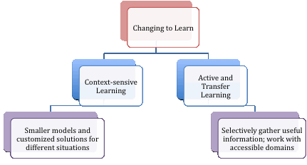
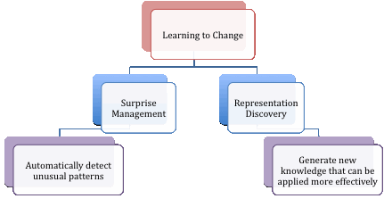

# Methodological Focus: Reasoning with Change
Our current research concentrates on addressing the changing nature of dynamic decision making. The main theme of this work can be summarized as "change representation to learn effectively and learn to change representation when necessary".

## Changing to Learn

In real world settings, it is often very difficult or even impossible to traverse the entire solution space for problem solving and decision making. The search space can be reduced by integrating control structure or domain knowledge, or by combining deterministic knowledge to guide learning under uncertainty. In face of incomplete and changing information, we can selectively and sequentially focus on the problem in a relevant context, or to transform the problem space to facilitate structural and parameter learning in model formulation. We are working on two major directions in addressing the main challenges:

### Context-sensitive learning

-Recent work in probabilistic relation models that combine first-order logic and probabilistic graphical networks or Bayesian networks to represent real-world problems, allows instantiation of partial network structure to support learning and reasoning. We have introduced a new language, context-sensitive network (CSN) that partitions the model in principled way, and treats situation variations as functions of a set of context variables. By dynamically adapting part of the model according to specific contexts as new evidence arrives, focused reasoning and learning can be supported, even with incomplete and changing information. On going research focuses on extending context-sensitivity into temporal relational models, and with partial observability.

### Active learning and transfer learning

Active and transfer learning explicitly change the world dynamics to force new observations, and mapping learning parameters from one problem domain to another. Accurate models are difficult to build from pure observations with sparse and/or incomplete data. We have worked on active learning techniques in Bayesian networks that allow learning through introducing specific interventions to support hypothesis generation and verification. Future work will address effective ways to focus on and evaluate relevant information in changing environments. Another area of interest is transfer learning of structured data where the instances are not independently and identically distributed, e.g., entities in social networks and unknown diseases, which pose substantial challenges in changing or combining representations from different sources to learn new knowledge in the target domain.

## Learning to Change

In real-world problems, e.g., in game playing, the preconceived notion of natural categories or opponent types may be misleading, or changing over time. It is therefore important for learning techniques to detect and effect such change. Anomaly detection, problem reformulation, e.g., from time and space to frequency domains, or approximate models are common approaches to effect representation change. We focus on an integrated approach that establishes an operational definition of “change” – When evidence mounts and the default assumptions are violated, a set of proper actions are taken to effect the change. For example, experience gained from first-principled decision making in a complex situation may induce a set of "fast and frugal" rules that can be applied more efficiently and effectively in routine decision making. We are working on two major directions in addressing the main challenges as follows:

### Surprise management

We have proposed a reasoning framework that extends the notion of surprise as an information measure in Markov decision processes. Some cognitive measures are incorporated to define the nature of surprise, and evidence is collected to determine when changes have happened. Traditional learning approaches such as Reinforcement Learning assume stationary characteristics over the course of problem, and are unable to learn the dynamically changing settings correctly. We are developing an adaptive framework that can detect dynamic changes due to non-stationary elements. Currently surprise detection only affects strategy adjustments but not representational changes in decision making. Future work includes incorporating surprise management in representational discovery.

### Representation discovery

We have worked on generating strategies or policies from solving dynamic decision models over time and under uncertainty. Such policies are in the form of “rules” that can be applied in different situations. To accommodate the changing environment, a gradual rule generation scheme can be incorporated; this is similar to cognitive frameworks such as ACT-R where transformation of knowledge occurs when sufficient activation strength is reached for certain patterns in the underlying neural or probabilistic network, and leads to a rule firing. When enough rules get fired, new rules are extracted from the original set and become new knowledge. We are also looking into model minimization as a form of representation discovery. Future work includes deciding on the relevant forms of representation for different tasks, as well as dealing with incomplete information and temporal models.