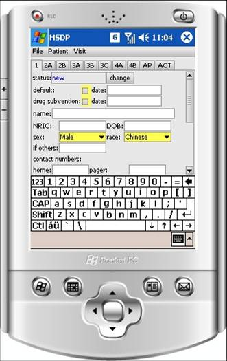
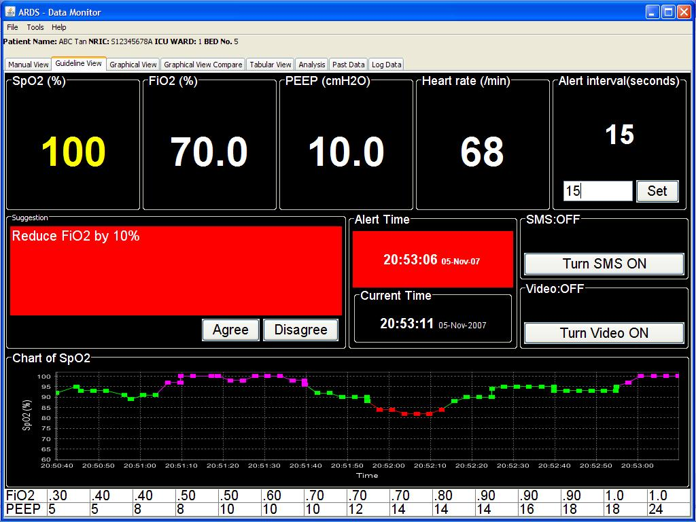

# RESEASY

- ARDS
- Asthma
- MedComp
- Contact
- Download
- Partners
- People

## A Workbench for Facilitating Best Practices from Prospective to Acute Care in Respiratory Medicine

Led by the Medical Computing Laboratory at the School of Computing, National University of Singapore, and partners, our project aims to develop an open, adaptive trial workbench for cost effective decision support in healthcare. Our workbench architecture is based on a set of generic information management and analysis toolboxes that support integration, visualization, analysis, security and communication of the relevant information. The toolboxes can be generalized and adapted to different diseases or conditions, and be deployed in multiple sites.

The ResEasy project initially focuses on facilitating best practices in process management, guideline execution and outcome analysis in the prospective care of Asthma patients, and acute care of Acute Respiratory Distress Syndrome (ARDS) patients. We adopt an incremental, modular development approach to incorporate a wide spectrum of information processing technologies to implement the basic infrastructure of a general, comprehensive evidence adaptive decision support system in biomedicine.

### ResEasy - Asthma	
__Chronic care, including Data collection unit__
- Patient particulars,	
- Asthma history,	
- Asthma medication information	
and Action plan unit,	
- Colored asthma zone display, as defined by asthma guideline,	
- Colored medication display based on patient's prescriptions	

### ResEasy - ARDS
__Acute care__
- Real time monitoring of patients under ventilation,
- ARDSnet guideline based suggestions,
- ARDSnet guideline based suggestions,
- Remote secured access to patient's information,
- SMS alerting (with third party solutions),
- Remote video monitoring on request (with third party solutions),
- Analysis of the past data for decision support

